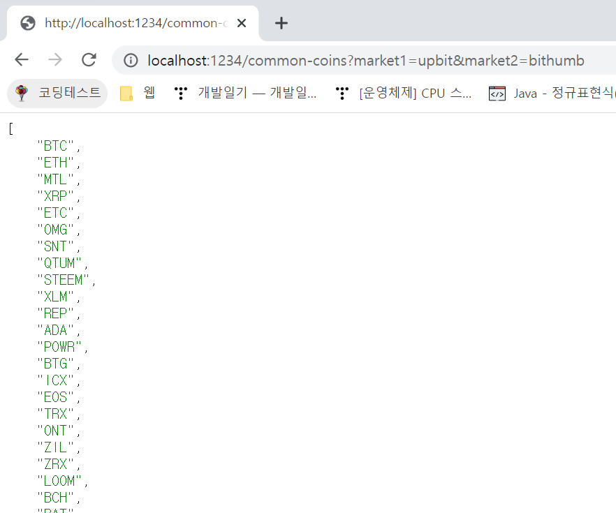

# 코인 허브 스프링 부트 프로젝트

## 개발 동기
- `개발자 장고`님의 유튜브를 보고 아이디어가 참신하다는 생각이 들어 따라하기로 마음 먹었다.
- 그리고 기존에 배웠던 지식들을 첨가해서 완성시키고 싶은 마음이 커졌다.
- 중점으로 둘 부분은 이슈를 발행하고 혼자서 마치 협업하는 것처럼 따라잡기를 할 예정이다.

## 아이디어
- A거래소와 B거래소 간의 특정 코인의 가격 차이를 계산해서 A거래소에 있는 코인을 B거래소에 옮겨 팔면 수익이 난다.
- 그러나 수수료가 크기 때문에 불가능점을 인지
- 코인마다 이 수수료가 다 다르기 때문에 
- B거래소에서 어떤 코인을 사서 A로 넘어갔을 때 <b>가장 적은 수수료로 이체를 할 수 있는지를 계산하는 프로그램</b>을 만들어본다.

### 22.12.16
- `FeignClient` 외부 라이브러리 추가
- 오픈 API 다룰 서비스 계층 구성
- 거래소의 이름과 코인의 이름을 입력받아 현재 코인의 가격을 보여주는 페이지를 컨트롤러에 작성
- 롬복 라이브러리 추가

### 22.12.19
- 전체적인 비즈니스 로직을 서비스를 통해 구현
- DTO 를 이용하여 각 계층 간의 데이터 이동을 처리
- `Upbit`와 `Bithumb` 거래소에서 공통으로 거래하는 코인들의 목록을 보여주는 부분을 구현

### 22.12.21
- `BithumbMarketService`, `CommonMarketService`, `UpbitMarketService` 테스트 코드 구현
- 호가창을 이용해서 살 수 있는 코인과, 몇 개를 살 수 있는지 추천해주는 서비스 기능을 구현(빗썸만)
- reference : https://apidocs.bithumb.com/reference/%ED%98%B8%EA%B0%80-%EC%A0%95%EB%B3%B4-%EC%A1%B0%ED%9A%8C-all 
- `calculateBuy()` 메서드를 테스트하는 테스트 코드 구현

### 22.12.22
- 거래소 둘다 수수료의 정보를 가져오는 부분은 오픈 API로 제공하지 않았다
- 그 문제를 해결하기 위해 웹 크롤링을 시도하기 위한 `JSOUP` 라이브러리를 추가
- 빗썸 수수료 크롤링 : https://www.bithumb.com/customer_support/info_fee 
- 업비트 수수료 크롤링 -> 문제가 발생했는데

- get으로 수수료가 있는 페이지를 요청했을 때 -> root와 modal 안의 태그들이 다 없어져 있다 -> 크롤링 불가
- 네트워크 요청을 확인해서 다른 곳에서 읽어서 오는 건지 확인

- https://api-manager.upbit.com/api/v1/kv/UPBIT_PC_COIN_DEPOSIT_AND_WITHDRAW_GUIDE 곳에서 코인과 수수료 정보를 볼 수 있다는 것을 알아내었다
- 따로 `UpbitFeeFeignClient` 를 만들어 업비트 수수료 데이터를 가져올 수 있었다.
- 낮은 가격에 사서 높은 가격에 팔기 위해 `calculateBuy()`, `calculateSell()` 메서드의 세부 로직을 작성하였다.
- 수수료의 경우 통합 테스트를 통해 검증하였고, 메서드 검증은 단위 테스트로 검증하였다.

### 22.12.23
- `TransferCalculateService` 를 작성하였고, 이미 만들어 놓은 각 서비스의 메서드를 이용해서 `calculate()` 메서드를 구현할 수 있었다.
- 코인들의 거래 차익을 보여주는 정보들 몇 가지를 추가하였고, 컨트롤러까지 수정하였다.

- 업비트 -> 비트코인 100만원을 넣었을 때 거래 차익을 계산해서 나열해주는 부분이다.